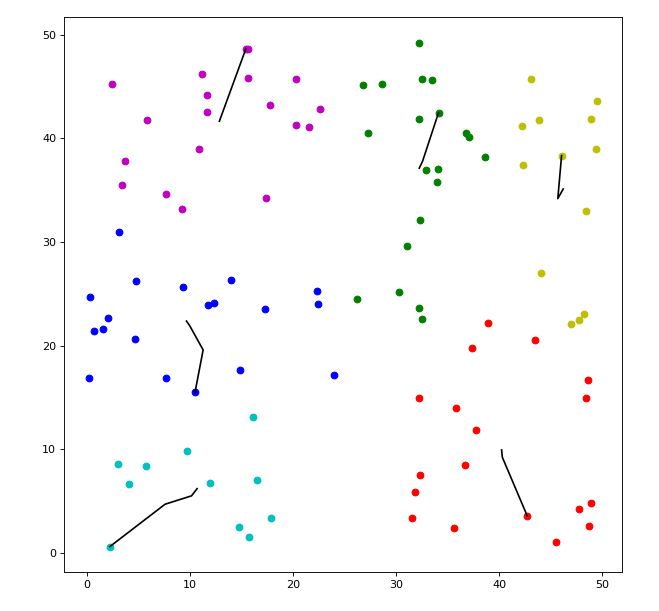

# Clustering Algorithms Visualization

This repository demonstrates various clustering algorithms using Python and visualizes the results using matplotlib. The algorithms included are:

- **K-means++ (Euclidean)**
- **K-means (A*)**
- **DBSCAN**

Each algorithm's clustering result is shown below. The images demonstrate how each algorithm handles data points and obstacles differently. You can run the code to see these visualizations in action.

## Results
### didn't consider obstacle

  
  

    <h3>K-means++ (Euclidean)</h3>
    
  

  

    <h3>DBSCAN</h3>
    
  

### consider obstacle

  
  

    <h3>K-means A*</h3>
    
     
This algorithm takes more time

  

